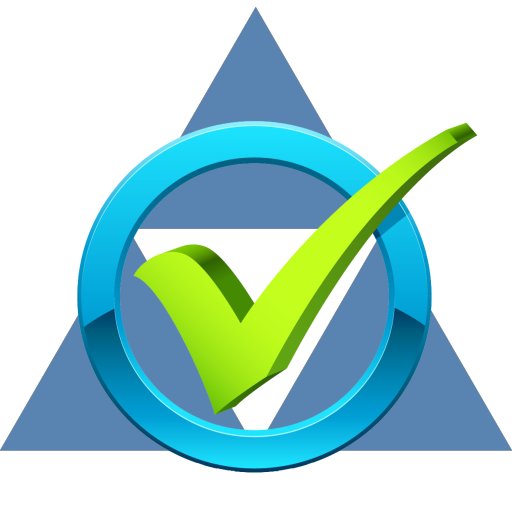
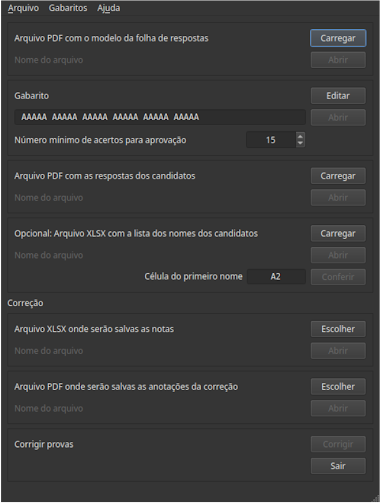

# CorretorENA

{ width="250" }

O CorretorENA é programa para corrigir automaticamente as provas do
Exame Nacional de Acesso ao Profmat (ENA),
desenvolvido por Luis A. D'Afonseca,
professor do CEFET-MG e ex-coordenador local do Profmat.

O programa pode ser baixado gratuitamente desta
[página](./pages/download.md).

As instruções de uso estão na
[documentação](./pages/documentacao.md).

{ width="300" }
/// caption
Tela do programa.
///

{ width="300" }
/// caption
Folha de respostas do candidato. Todas as folhas precisam estar escaneadas em PDF.
///

{ width="300" }
/// caption
Folha de respostas corrigida. O programa criar um PDF com as correções realizadas
para facilitar a revisão.
///